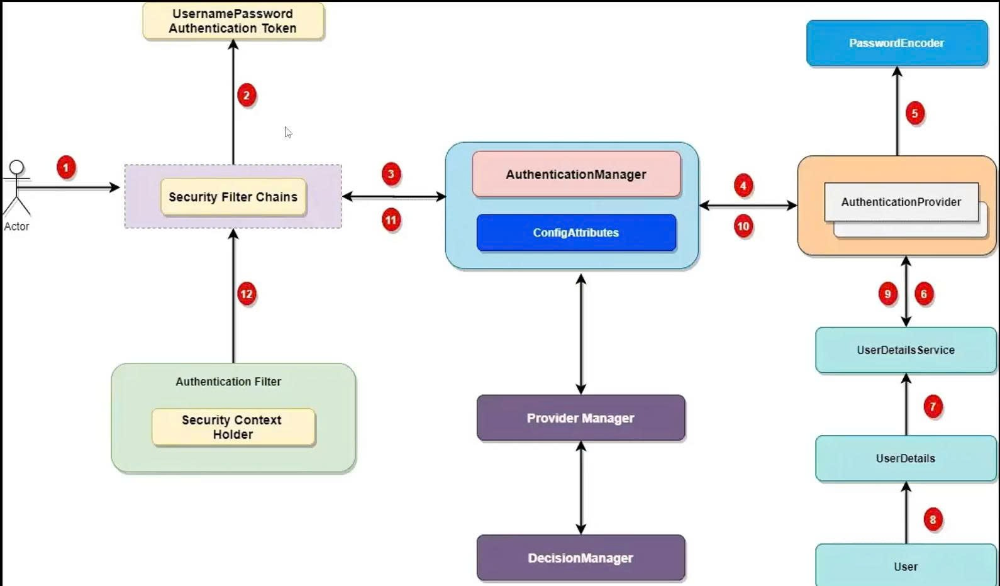

Ex7_Restful API_Spring
Viết các API về sản phẩm, danh mục. Yêu cầu có validate dữ liệu
- 1 yêu cầu sql ở ex03 là 1 api
- Api cơ bản sản phẩm
    + POST /admin/products : Thêm mới 1 sản phẩm
    + PUT /admin/products/{id} : Cập nhật một sản phẩm
    + GET /admin/products/{id} : Lấy thông tin 1 sản phẩm
    + GET /admin/products: Cho phép lọc sản phẩm theo tên, có phân trang (Theo 2 kiểu, mỗi trang tối đa 10 bản ghi)
- Làm tương tự tạo các API danh mục, kho
  Lưu ý API xoá danh mục sẽ xoá đồng thời xoá sản phẩm thuộc danh mục đấy ( Y/c sử dụng transaction)

